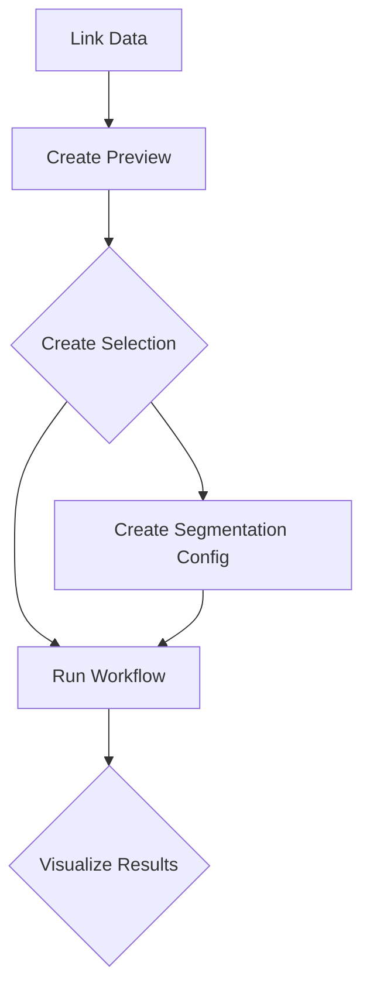

# Single Worm Imaging Workflow
Processing single worm imaging data involves several steps. The following flowchart shows the steps involved in the process:


!!! note "SLURM vs Local Processing"
    The main processing is done on the SLURM cluster (rectangular boxes). However, visualization and manual annotation are done locally (diamond boxes). This means that we will have a copy of this repository on the fileserver and the local computer.


## Link Data [SLURM]
We want to keep track of which raw data was used as part of this project. To facilitate this, we will create a symbolic link to the raw data in the `raw_data` directory.

!!! warning "SLURM"
    This step is done from the SLURM head node.

```commandline
cd raw_data
ln -s /path/to/raw/data/dataset
```

Please fill out the following form with the appropriate values:

{{{user-defined-values}}}

!!! info "Output"
    All processed output data will be stored on the fileserver in the `processed_data/DATASET` directory of this repository.

## Create Preview [SLURM]
The preview is a reduced representation of the raw data. It is used to pre-select the data that will be used for the analysis.

```commandline
source init.sh
WD=runs/DATASET ACCOUNT=SLURM_ACCOUNT pixi run convert_to_zarr_slurm
```

## Create Selection [Local]
This step is about manually reviewing your microscopy experiment to annotate **hatch**, **escape**, and **validity** for each worm chamber. You’ll do this using a Jupyter Notebook and the napari viewer. The results will be saved to a folder of your choice (e.g., `runs/20250101_GeneX`), and the process takes around **30 minutes-1 hour**.

!!! warning "Local Processing"
    This step is done from the local computer.

```commandline
WD=runs/DATASET pixi run create_selection
```

??? info "Step-by-Step Instructions"

    #### 1. Open the Terminal

    Navigate to your project folder:

    === "Linux and macOS"

        ```bash
        cd <path_in_your_computer_to>/ggrossha_SWI-Template
        ```

    === "Windows (PowerShell)"

        ```powershell
        cd <path_in_your_computer_to>\ggrossha_SWI-Template
        ```

    Replace <path_in_your_computer_to> with the full path to the location where you cloned the ggrossha_SWI-Template repository.

    ---

    #### 2. Create Output Folder and Launch the Analyzer

    Choose a name for your analysis folder—this can be anything meaningful, like `20250101_GeneX`. You’ll use this to label and organize your results.

    Run the following command in your terminal, replacing `<your_experiment_name>` with the name you chose:

    === "Linux and macOS"

        ```bash
        WD=runs/DATASET pixi run create_selection
        ```

    === "Windows (PowerShell)"

        ```powershell
        $env:WD='runs/DATASET'; pixi run create_selection
        ```

    **Example**: If your experiment is called `20250101_GeneX`, you would run:
    `WD=runs/20250101_GeneX pixi run create_selection`

    This command will:

    - Create the folder `runs/<your_experiment_name>` if it doesn't exist
      - Copy the `Create_Selection.ipynb` notebook into that folder
      - Launch the notebook in Jupyter Lab

    ---

    #### 3. Run the First Two Cells in the Notebook

    These cells will:

    - Import necessary packages
      - Open the napari viewer

    ---

    #### 4. Select the Processing Directory

    In the **Jupyter Notebook** (not napari), set the path to the cloned repository on **Tachyon**, for example:

    ```bash
    /tachyon/scratch/gmicro_prefect/ggrossha/ggrossha_SWI-Template
    ```

    Then:

    - Press "Change"
      - Run the third cell to set this path as the root directory


    ---

    #### 5. Select the Experiment

    In the next section of the notebook:

    - Run the first cell
      - Select the experiment (created in Step 2)
      - Run the remaining three cells in this section

    ---

    #### 6. Annotate All Positions in napari

    Switch to the **napari viewer**. You should see the first position loaded at timepoint 0.

    Use the following keyboard shortcuts to annotate:

    | Key | Action          | Description                                                         |
    |-----|------------------|---------------------------------------------------------------------|
    | `S` | Skip             | Marks worm as *invalid* (default is valid)                         |
    | `E` | Set start        | Marks first frame where worm exits the egg                         |
    | `R` | Set end          | Marks frame where worm escapes, lays eggs, or another worm enters  |
    | `W` | Next worm        | Move to the next position                                          |
    | `Q` | Previous worm    | Move to the previous position                                      |


    ---

    #### 7. Save the Annotation File

    Return to the **Jupyter Notebook** and run the last two cells in the "Annotation" section.

    This will:

    - Save your annotations
      - Output a `.csv` file in your defined folder

    ---


    #### 8. Add Conditions and Notes

    Open the `.csv` file and manually add:

    - The **condition name**
      - Any additional **notes**


## Run Workflow [SLURM]
Once a selection has been made, the workflow can be run. The workflow will convert the raw data to ome-zarr, according to the selection. The raw data will be segmented if a segmentation config is provided.

??? info "Create Segmentation Config"
    ```commandline
    WD=runs/DATASET pixi run config
    ```

```commandline
WD=runs/DATASET ACCOUNT=SLURM_ACCOUNT MAIL=MAIL_TO pixi run submit_workflow_slurm
```
