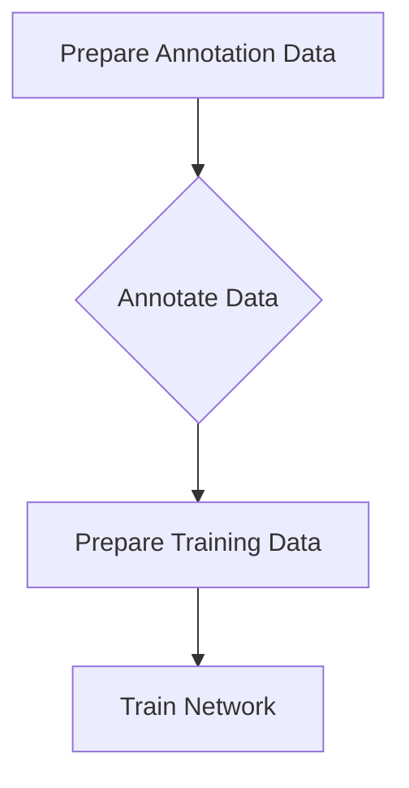

# Train Network
To segment the worms in the brightfield images a neural network is used.
The neural network is trained on a set of manually annotated images.
If you have a pre-trained network and notice that the segmentation results are not satisfying, you can fine-tune the network on additional manually annotated data.

The network training is organized in the following steps:



!!! note "SLURM vs Local Processing"
    The main processing is done on the SLURM cluster (rectangular boxes). However, visualization and manual annotation are done locally (diamond boxes). This means that we will have a copy of this repository on the fileserver and the local computer.

## Input Data
You need to convert your data to ome-zarr with the Single Worm Imaging Workflow before you can start the training process.

## 1. Prepare Annotation Data [SLURM]
The annotation data is prepared by extracting the brightfield images and pre-computing the embeddings for the micro-sam annotator.

Please fill out the following form with the appropriate values:

{{{user-defined-values}}}

```commandline
WD=runs/DATASET ACCOUNT=SLURM_ACCOUNT pixi run prepare_annotation_data_slurm
```

__Outputs__

This will create outputs in `processed_data/DATASET/annotation_data`:

* `...-embeddings.zarr`: These are pre-computed embeddings to use with micro-sam.
* `....tif`: Stack of the z projected brightfield images (2D + Time).

## 2. Annotate the data [Local]
For annotating the data we use [micro-sam](https://github.com/computational-cell-analytics/micro-sam). To start the annotator run the following command:

```commandline
TIFF=/path/to/processed_data/DATASET/annotation_data/....tif EMBEDDING=/path/to/processed_data/DATASET/annotation_data/...-embedding.zarr pixi run annotate_data
```

Once you are done, save the `committed_objects` into the `processed_data/DATASET/annotation_data/` directory, next to the input `.tif` (e.g. `worm_1_s1.tif`) with the same name and the suffix `-SEG` e.g. `worm_1_s1-SEG.tif`.

## 3. Prepare training data [SLURM]
```
WD=runs/DATASET ACCOUNT=SLURM_ACCOUNT pixi run prepare_train_data_slurm
```

__Outputs__

This will create outputs in `processed_data/DATASET/training_data`:

* `worm-segmentation-train-data.zarr`: Training data zarr.
* `worm-segmentation-val-data.zarr`: Validation data zarr.
* `proof_read_train`: Directory containing a `png` file for each sample in the training dataset. These are the inputs and targets for the neural network.
* `proof_read_val`: Directory containing a `png` file for each sample in the validation dataset. These are the inputs and targets for the neural network.


## 4. Train the network [SLURM]

```commandline
WD=runs/DATASET ACCOUNT=SLURM_ACCOUNT pixi run train_network_slurm
```

__Outputs__

This will create outputs in `processed_data/DATASET/segmentation_model`:

* `lightning_logs`: Directory containing the training logs.
* `validation-preview`: After each epoch some validation predictions are saved as `png` files in this directory.
* `ckpt`: Model checkpoints.
